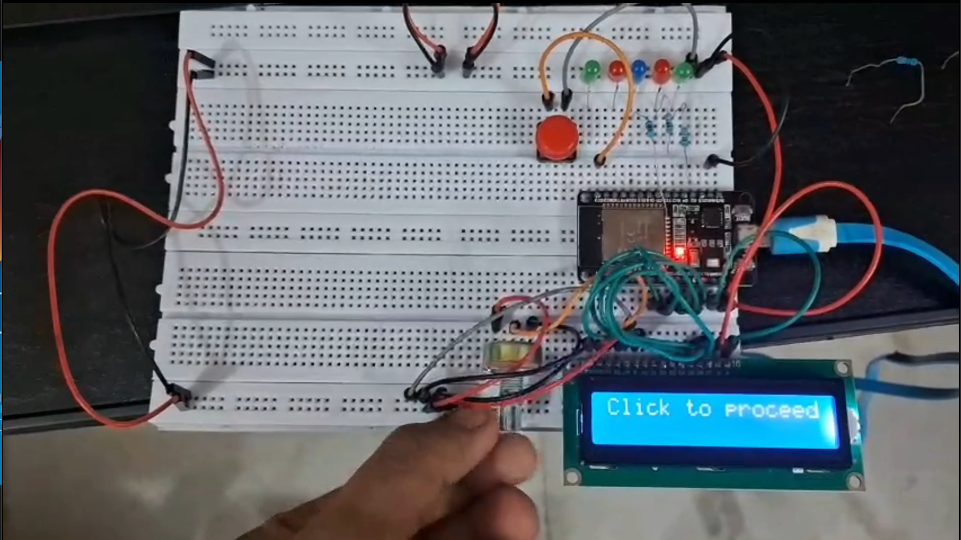

## Welcome to the Hardware-Meets-Software Music Genre Classifier! 🎸💻

### Introduction to the Project

This project is an automated music genre classification system that bridges the gap between software algorithms and physical hardware! It uses MATLAB to analyze the acoustic properties of audio files and predict their genre using a k-Nearest Neighbors (k-NN) machine learning model. Once the genre is identified, the prediction is beamed over a Wi-Fi TCP connection to an ESP32 microcontroller. The ESP32 then provides a fun, physical readout of the genre via an LCD screen and customized LED indicators.

### Why It's Useful

* **Educational Powerhouse:** It is a fantastic, hands-on way to learn about digital signal processing, audio feature extraction, and machine learning.

* **IoT Integration:** It demonstrates exactly how to connect local computer scripts with IoT microcontrollers using TCP/IP communication.

* **Automated Tagging:** It takes the guesswork out of sorting your music library by mathematically classifying tracks based on their spectral data instead of human guesswork.

### What is Innovative About This Project

The magic lies in how it turns abstract data into a physical, interactive experience! Instead of just printing a boring text output on a computer screen, it forces the digital and physical worlds to shake hands. By extracting complex acoustic features like spectral centroid, spectral flux, and MFCCs, the software deeply "listens" to the music. Then, a physical button press on your breadboard triggers the hardware's Wi-Fi server. When MATLAB sends its prediction, the hardware reacts dynamically, illuminating specific colored LEDs (like a red LED for Metal or a green LED for Rock) based on the AI's conclusion.

### How to Use the Files and This Project

1. **Prepare the Data:** Organize your audio files (`.mp3` or `.wav`) into subfolders named after their genres inside a main `Music Library` directory.

2. **Extract Features:** Open MATLAB and run `create_genre_dataset.m`. This script will analyze your library, extract the audio features, and generate a `genre_features.csv` database.

3. **Deploy Hardware:** Wire your ESP32 to an LCD, a push button (on pin 23), and your colored LEDs, then upload the `SNS_prok.ino` code to the board.

4. **Start the Server:** Power up the ESP32 and press the physical push button on your breadboard to connect to your Wi-Fi and initialize the TCP server.

5. **Analyze and Illuminate:** Open `genre_analyzer.m`, set your ESP32's IP address, and select a test song. Run the script to predict the genre, send the data over TCP, and watch your hardware come to life!

### How the Project Looks

Here is the hardware in its standby state, waiting for the server to be initiated:

---

Keep rockin' and codin'! Feel free to hack this project further—add more genres to your dataset, wire up a whole rainbow of LEDs, or even connect it to a disco ball. Happy listening! 🎧✨
